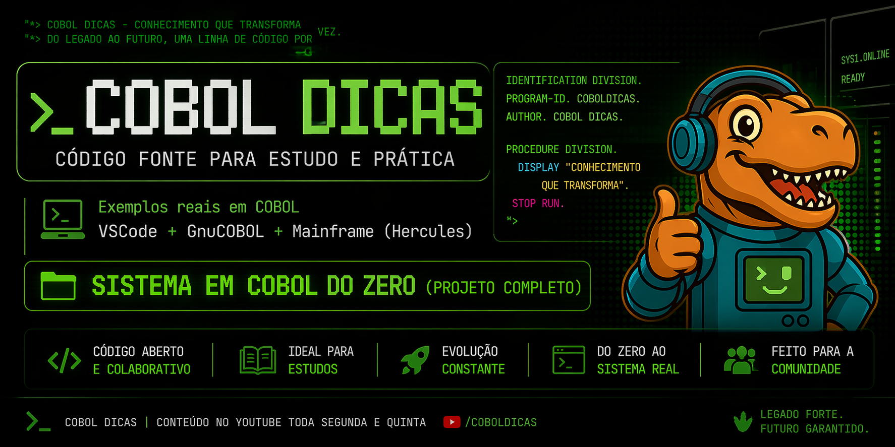

  

  <!-- Se quiser, substitua pelo banner -->
  <!--  -->

# 🦖 COBOL Dicas

**Repositório oficial de exemplos e programas do projeto COBOL Dicas**

📺 Lives semanais | 💬 Fórum ativo | 🧠 Conteúdo técnico sobre COBOL, CICS, DB2, VSAM e JCL

---

## 🪙 Selos do Projeto

---

## 📂 Conteúdo

Este repositório reúne os programas e exemplos utilizados nas lives, tutoriais e artigos do projeto **COBOL Dicas**:

- 💻 Programas COBOL (GnuCOBOL e Mainframe)  
- ⚙️ Exemplos de CICS (transações online)  
- 🧠 Consultas e comandos DB2 (SQL embutido)  
- 🪣 Estruturas VSAM (KSDS, ESDS, RRDS)  
- 🧾 Scripts e utilitários JCL  
- 🧰 Exercícios e testes de integração no Hercules TK5  

---
🧠 Tecnologias e Ferramentas
- 🖥️ COBOL - Linguagem principal
- 🧾 JCL - Controle de jobs batch
- 🧠 DB2 - Banco de dados relacional
- ⚙️ CICS - Processamento online
- 🪣 VSAM - Arquivos e índices
- 💿 Hercules TK5 - Emulador de mainframe
- 💻 VS Code - Ambiente de desenvolvimento

---
🔗 Links Oficiais:
- 🌐 Site: https://coboldicas.com.br
- 💬 Fórum: https://forum.coboldicas.com.br
- 🎥 YouTube: https://youtube.com/@coboldicas
- 🎙️ Podcast: https://www.youtube.com/playlist?list=PLO7GuUJuM4BXHDh2SvdyUzvXg7xpyea2f
- 💼 LinkedIn: https://www.linkedin.com/company/coboldicas

---
🤝 Contribuições
Contribuições são bem-vindas!

Abra uma Issue para sugestões
Envie um Pull Request com melhorias

Este é um repositório educativo e colaborativo — a comunidade é parte essencial do projeto.

---
🧾 Licença

Este projeto está sob a licença MIT — use, aprenda e compartilhe.
---

 © COBOL Dicas – O básico e o avançado de COBOL, sem mistério.   🦖 <strong>COBOL Dicas – O legado continua.</strong> 

